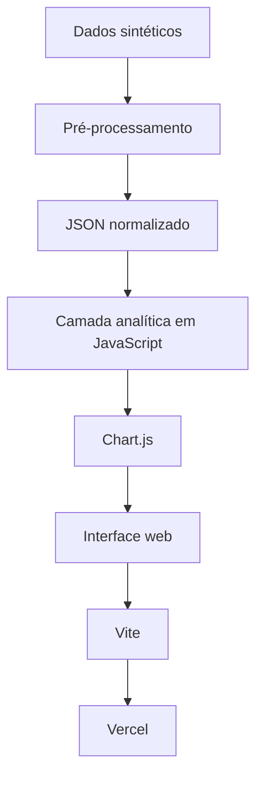
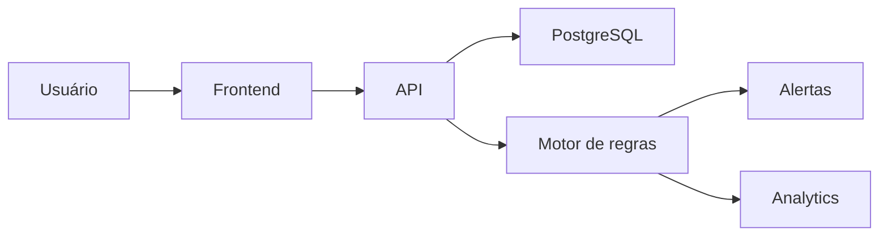

# ServiceOps Analytics Dashboard

<p align="center">
  <strong>Aplicação web interativa para análise de operações de TI, SLA, TMA, TMR, backlog, aging, prioridades, ambientes e melhoria contínua.</strong>
</p>

<p align="center">
  <a href="https://serviceops-analytics-dashboard.vercel.app"><strong>🌐 Live Demo</strong></a>
  &nbsp;&nbsp;•&nbsp;&nbsp;
  <a href="https://github.com/Vynys/serviceops-analytics-dashboard"><strong>💻 GitHub</strong></a>
</p>

<p align="center">
  
  
  
  
  
</p>

> ⚠️ **Todos os dados utilizados neste projeto são 100% sintéticos e foram gerados exclusivamente para demonstração e portfólio. Nenhuma informação real de empresas, clientes ou pessoas é utilizada.**

---

## 📌 Sobre o projeto

O **ServiceOps Analytics Dashboard** é uma aplicação web interativa criada para transformar dados operacionais de TI em informações claras, exploráveis e úteis para tomada de decisão.

O projeto foi desenvolvido como um case de portfólio para demonstrar competências em:

- análise de dados;
- definição de indicadores;
- regras de negócio;
- visualização de dados;
- desenvolvimento web;
- UX aplicada a analytics;
- performance;
- responsividade;
- drill-down e investigação operacional.

A ideia principal foi construir algo que fosse além de um dashboard estático.

O usuário pode sair de uma visão executiva, identificar um problema, aplicar filtros cruzados, analisar tendências e chegar até o nível individual de cada registro.

```text
Indicador
    ↓
Tendência
    ↓
Segmentação
    ↓
Identificação do problema
    ↓
Drill-down
    ↓
Registro individual
    ↓
Tomada de decisão
```

---

## 🎯 Problema

Em muitos cenários operacionais, a análise ainda depende de:

- múltiplas planilhas;
- filtros manuais;
- relatórios separados;
- cálculos repetitivos;
- pouca integração entre indicadores;
- dificuldade para investigar a causa de um problema.

Uma análise simples pode acabar seguindo um fluxo como:

```text
Quantos incidentes tivemos?
        ↓
Filtrar planilha

Qual ambiente concentrou os incidentes?
        ↓
Criar outro filtro

Qual foi o SLA?
        ↓
Executar novo cálculo

Quais chamados romperam?
        ↓
Filtrar novamente

Por que romperam?
        ↓
Investigar linha por linha
```

O objetivo do projeto foi centralizar esse processo em uma única aplicação analítica.

---

## 🚀 Objetivos

O projeto foi desenvolvido com quatro objetivos principais:

1. **Transformar dados operacionais em indicadores claros.**
2. **Permitir análise exploratória sem depender de filtros manuais em planilhas.**
3. **Conectar diferentes indicadores para facilitar a investigação de problemas.**
4. **Criar uma experiência semelhante a uma ferramenta de BI dentro de uma aplicação web customizada.**

---

# 📊 Principais funcionalidades

## Visão Geral

A primeira seção responde rapidamente à pergunta:

> **Como está a operação?**

Os principais KPIs são:

| Indicador | Objetivo |
|---|---|
| Total de chamados | Medir o volume operacional |
| Horas dedicadas | Avaliar esforço registrado |
| TMA | Medir o tempo até o primeiro atendimento |
| TMR | Medir o tempo total até a resolução |
| SLA 1º atendimento | Avaliar aderência ao prazo inicial |
| SLA resolução | Avaliar aderência ao prazo de resolução |

Os indicadores também apresentam comparação com períodos anteriores.

Isso permite diferenciar:

```text
SLA caiu
```

de uma análise mais contextualizada:

```text
SLA caiu
+
volume aumentou
+
TMR também aumentou
```

Esses cenários podem levar a decisões completamente diferentes.

---

## 📅 Análise temporal

Na seção de demandas, os dados podem ser analisados por **dia dentro da semana selecionada**.

Exemplo:

```text
Segunda    34
Terça      46
Quarta     36
Quinta     75
Sexta      38
Sábado     22
Domingo     7
```

Um pico concentrado em determinado dia pode indicar:

- aumento pontual de demanda;
- deploy ou mudança recente;
- indisponibilidade de algum serviço;
- comportamento operacional recorrente;
- necessidade de redistribuição de capacidade.

---

## 🔄 Cross-filter entre gráficos

Uma das principais funcionalidades do projeto é a interação entre os componentes.

Os gráficos não funcionam isoladamente.

Ao selecionar um período, prioridade, ambiente ou ponto específico de um gráfico, os demais indicadores da seção são recalculados automaticamente.

Exemplo:

```text
258 incidentes
      ↓
Selecionar quinta-feira
      ↓
75 incidentes
      ↓
Selecionar prioridade P1
      ↓
23 incidentes P1 na quinta-feira
```

Os filtros podem envolver:

- período;
- dia;
- prioridade;
- ambiente;
- status;
- tipo de item.

---

## 🚨 Análise de prioridade

A distribuição por prioridade permite entender a composição da demanda.

Categorias analisadas:

```text
P1
P2
P3
P4
```

O volume isolado nem sempre é suficiente.

Uma operação pode ter muitos chamados, mas se a maioria for P4, o cenário é muito diferente de uma operação com crescimento significativo de P1.

Por isso, prioridade pode ser analisada junto com:

- volume;
- horas;
- TMA;
- TMR;
- SLA;
- ambiente.

Perguntas que podem ser respondidas:

> Os chamados mais críticos estão sendo atendidos mais rapidamente?

> Alguma prioridade está consumindo esforço desproporcional?

> O aumento de P1 está afetando o SLA geral?

---

## ⏱️ TMA e TMR

Os tempos são apresentados em formato:

```text
HH:MM:SS
```

### TMA — Tempo Médio de Atendimento

Representa quanto tempo, em média, o chamado leva até receber o primeiro atendimento.

### TMR — Tempo Médio de Resolução

Representa quanto tempo, em média, o chamado permanece até ser resolvido.

A comparação entre os dois ajuda a identificar onde está o gargalo.

Exemplo:

```text
TMA baixo
TMR alto
```

Pode indicar que o time inicia rapidamente o atendimento, mas encontra dificuldades durante a resolução.

Já:

```text
TMA alto
TMR normal
```

Pode indicar um problema de fila ou capacidade antes do início do atendimento.

---

## ✅ SLA

O dashboard acompanha dois indicadores independentes:

### SLA de primeiro atendimento

Avalia se o chamado recebeu o primeiro atendimento dentro do prazo esperado.

### SLA de resolução

Avalia se o chamado foi resolvido dentro do prazo definido.

Mostrar apenas:

```text
SLA = 99,5%
```

não é suficiente para entender o problema.

Por isso, os KPIs possuem detalhamento dos chamados que romperam o SLA.

---

## 🔎 Chamados com SLA rompido

Ao clicar em um KPI de SLA, o dashboard identifica quais chamados não atenderam ao prazo.

O detalhamento pode apresentar:

```text
Chamado
Prioridade
Ambiente
Resumo
Tempo decorrido
Tipo de SLA rompido
```

Exemplo:

```text
INC-10482

Prioridade: P1
Ambiente: CORE

SLA de resolução rompido

Tempo até resolução:
04:14:01
```

Isso transforma um indicador agregado em uma informação operacional concreta.

---

## 🧩 Drill-down dos KPIs

Os principais indicadores possuem uma opção de **Tabela**.

Ao clicar em um KPI como:

```text
Total de chamados
```

é possível sair da visão agregada:

```text
357 chamados
```

e acessar individualmente os registros que compõem aquele indicador.

A tabela pode apresentar:

- chamado;
- tipo;
- prioridade;
- status;
- ambiente;
- resumo;
- responsável;
- data de criação;
- data de resolução;
- tempo gasto;
- TMA;
- TMR;
- SLA de primeiro atendimento;
- SLA de resolução.

Cada coluna possui filtros independentes.

Exemplo de investigação:

```text
Ambiente = HML
+
Prioridade = P1
+
Status = Resolvido
+
SLA resolução = Rompido
```

Isso permite investigar o dado sem retornar para uma planilha externa.

---

## 📚 Backlog e Aging

O dashboard possui uma área específica para análise de backlog.

Em vez de mostrar apenas:

```text
16 chamados abertos
```

a aplicação analisa também a idade dos registros.

Faixas utilizadas:

```text
0–7 dias
8–14 dias
15–30 dias
>30 dias
```

Isso ajuda a diferenciar:

### Backlog grande e recente

Pode indicar aumento momentâneo de demanda.

### Backlog pequeno e envelhecido

Pode indicar tickets bloqueados, dependências ou baixa prioridade operacional.

São problemas diferentes e exigem ações diferentes.

---

## 🤝 Dependências externas

O status dos chamados ajuda a entender a composição do backlog.

Exemplo:

```text
16 chamados abertos

8 aguardando terceiros
4 aguardando solicitante
4 em atendimento
```

Uma análise superficial poderia concluir:

> Precisamos aumentar a capacidade do time.

Mas os dados poderiam indicar:

> Grande parte da fila está bloqueada por dependências externas.

Nesse caso, ações mais adequadas poderiam ser:

- criar uma rotina de acompanhamento;
- definir processos de escalonamento;
- criar alertas de aging;
- acompanhar fornecedores;
- estabelecer SLAs específicos para dependências externas.

Esse é um dos conceitos centrais do projeto:

> **Entender a causa antes de decidir a ação.**

---

## 🖥️ Análise por ambiente

O dashboard permite comparar diferentes ambientes ou plataformas.

Na versão demonstrativa:

```text
CORE
INTEGRATION
CONTAINERS
API-GW
HML
```

Cada ambiente possui indicadores como:

- incidentes;
- horas;
- TMA;
- TMR;
- SLA de primeiro atendimento;
- SLA de resolução;
- evolução histórica.

Isso permite responder:

> Qual ambiente concentra mais incidentes?

> Onde o TMR está maior?

> Qual ambiente está consumindo mais horas?

> Existe algum ambiente com deterioração do SLA?

> Algum ambiente apresenta tendência de crescimento de incidentes?

---

## 🧠 Classificação automática de HML

O projeto também implementa regras de classificação derivadas dos próprios dados.

Por exemplo:

```text
[HML] Falha durante processamento...
```

pode ser automaticamente classificado como:

```text
Ambiente = HML
```

mesmo quando a informação não existe explicitamente em uma coluna estruturada.

Esse processo representa uma etapa comum em projetos de dados:

```text
Dado bruto
    ↓
Regra de negócio
    ↓
Transformação
    ↓
Classificação
    ↓
Indicador
```

---

## 🛠️ Melhorias

A aplicação possui uma seção dedicada ao acompanhamento de iniciativas de melhoria.

É possível visualizar:

- total de melhorias;
- em andamento;
- aguardando terceiros;
- backlog de melhorias;
- evolução;
- distribuição por status.

A ideia é conectar operação e melhoria contínua:

```text
Problema recorrente
        ↓
Identificação
        ↓
Análise
        ↓
Iniciativa de melhoria
        ↓
Implementação
        ↓
Redução da recorrência
```

---

# 💡 Insights e decisões possíveis

O principal objetivo do dashboard não é apenas apresentar indicadores.

A intenção é apoiar decisões.

## Capacidade

Identificar dias ou ambientes com aumento de demanda e avaliar redistribuição de capacidade.

## Priorização

Verificar se incidentes críticos estão recebendo atenção proporcional ao impacto.

## SLA

Identificar exatamente quais chamados romperam os prazos e investigar a causa.

## TMA x TMR

Entender se o gargalo está antes do primeiro atendimento ou durante a resolução.

## Backlog

Distinguir aumento de volume de envelhecimento da fila.

## Dependências externas

Identificar tickets bloqueados por fornecedores, outras equipes ou solicitantes.

## Ambientes

Comparar volume, horas e desempenho entre plataformas.

## Melhoria contínua

Transformar problemas recorrentes em iniciativas de automação ou correção definitiva.

---

# 🧪 Exemplo de análise

## Insight

O backlog possui:

```text
16 chamados em aberto
15 com mais de 7 dias
```

Ao analisar os status:

```text
50% estão aguardando terceiros
```

## Interpretação

O volume de backlog poderia inicialmente indicar falta de capacidade interna.

Porém, a composição da fila mostra que uma parcela relevante depende de ações externas.

## Possível decisão

Antes de aumentar a capacidade da equipe, poderiam ser avaliadas iniciativas como:

```text
Rotina de acompanhamento
+
Escalonamento automático
+
Alertas de aging
+
SLA para fornecedores
```

## Indicadores para acompanhar depois

```text
% backlog > 7 dias
% aguardando terceiros
idade média
TMR
SLA resolução
```

Esse processo representa uma análise completa:

```text
Dado
 ↓
Insight
 ↓
Hipótese
 ↓
Ação
 ↓
Monitoramento
```

---

# 🏗️ Arquitetura

O projeto foi desenvolvido como uma aplicação web frontend.



O usuário final não precisa instalar nada.

Basta abrir o endereço no navegador.

---

# 🧰 Stack

| Tecnologia | Uso |
|---|---|
| HTML5 | Estrutura da aplicação |
| CSS3 | Interface e responsividade |
| JavaScript | Regras, filtros e interações |
| Chart.js | Visualizações |
| Vite | Build e desenvolvimento |
| Git | Versionamento |
| GitHub | Repositório |
| Vercel | Deploy |
| JSON | Dados processados |

---

# ⚡ Performance

Conforme o dashboard cresceu, performance passou a ser uma parte importante do desenvolvimento.

Manter vários gráficos simultaneamente ativos pode aumentar o consumo de:

- memória;
- CPU;
- GPU;
- canvas;
- event listeners.

Algumas otimizações implementadas:

```text
Lazy rendering
Destruição de gráficos fora da viewport
Cache limitado
Pré-processamento dos dados
JSON normalizado
Atualização apenas da seção afetada
Limitação de DPR do canvas
Redução de reconstruções desnecessárias
Debounce de interações
content-visibility
```

O objetivo foi manter a aplicação fluida mesmo com múltiplos gráficos e interações.

---

# 📱 Responsividade

O dashboard foi desenvolvido para se adaptar a diferentes resoluções.

Foram considerados:

```text
Desktop
Notebook
Tablet
Telas menores
Zoom do navegador
Escala do sistema operacional
```

Cards, KPIs, tabelas e gráficos reorganizam-se conforme o espaço disponível.

Indicadores como TMA e TMR receberam tratamento específico porque valores como:

```text
01:07:24
```

ocupam mais espaço visual do que indicadores numéricos menores.

---

# 🎨 UX e interação

Além dos indicadores, parte significativa do desenvolvimento foi dedicada à experiência de uso.

Entre os recursos implementados:

- scroll contínuo entre seções;
- menu lateral acompanhando a navegação;
- cross-filter;
- filtros por coluna;
- modal de detalhamento;
- drill-down;
- gráficos interativos;
- animações de transição;
- manutenção da posição da tela durante filtros;
- barra horizontal acessível em tabelas extensas;
- interface adaptativa.

---

# 🧱 Desafios técnicos

Alguns dos principais desafios encontrados durante o desenvolvimento:

- manter vários gráficos sincronizados;
- implementar filtros cruzados;
- evitar reconstruções completas da página;
- trabalhar com diferentes resoluções;
- manter TMA/TMR legíveis;
- criar drill-down até o nível do registro;
- construir filtros independentes por coluna;
- controlar consumo de memória;
- manter gráficos nítidos;
- evitar conflitos de scroll;
- otimizar o comportamento de canvas;
- preservar responsividade com muitos KPIs.

Grande parte do desenvolvimento foi iterativa:

```text
Implementação
     ↓
Teste
     ↓
Identificação de gargalo
     ↓
Refatoração
     ↓
Nova validação
```

---

# 📚 O que aprendi

Este projeto reforçou que uma boa solução de dados não termina na criação de gráficos.

Foi necessário trabalhar com:

- estrutura dos dados;
- regras de negócio;
- consistência dos cálculos;
- modelagem de indicadores;
- experiência do usuário;
- performance;
- responsividade;
- visualização;
- investigação analítica.

Também foi uma oportunidade de explorar uma abordagem diferente das ferramentas tradicionais de BI, construindo a camada analítica e de visualização diretamente dentro de uma aplicação web.

---

# 🔮 Próximas evoluções

Algumas possibilidades de evolução:

- backend dedicado;
- API REST;
- PostgreSQL;
- autenticação;
- controle de acesso;
- atualização automática;
- processamento server-side;
- alertas operacionais;
- detecção de anomalias;
- previsão de demanda;
- CI/CD;
- testes automatizados;
- histórico persistente;
- atualização em tempo real.

Uma arquitetura futura poderia evoluir para:



---

# 🔐 Segurança e privacidade

> ⚠️ **Todos os dados apresentados neste projeto são fictícios.**

Os chamados, responsáveis, IDs, ambientes, indicadores e demais informações foram gerados exclusivamente para fins de demonstração.

Nenhuma informação real de empresas, clientes ou pessoas é utilizada.

---

# ▶️ Executando localmente

Clone o projeto:

```bash
git clone https://github.com/Vynys/serviceops-analytics-dashboard.git
```

Entre na pasta:

```bash
cd serviceops-analytics-dashboard
```

Instale as dependências:

```bash
npm install
```

Execute:

```bash
npm run dev
```

O Vite exibirá um endereço semelhante a:

```text
http://localhost:5173
```

---

# 🌐 Live Demo

A aplicação está publicada e pode ser utilizada diretamente pelo navegador.

### **[Abrir ServiceOps Analytics Dashboard](https://serviceops-analytics-dashboard.vercel.app)**

Não é necessário instalar nenhuma ferramenta ou baixar arquivos.

---

# 💻 Repositório

### **[GitHub — serviceops-analytics-dashboard](https://github.com/Vynys/serviceops-analytics-dashboard)**

---

# 👨‍💻 Autor

Desenvolvido como projeto pessoal de portfólio com foco em:

**Data Analytics · Data Visualization · ServiceOps · JavaScript · BI · Frontend Analytics**

---

## ⭐ Gostou do projeto?

Se este projeto foi útil ou interessante:

- teste a aplicação;
- explore os filtros;
- analise os KPIs;
- confira o código;
- deixe uma ⭐ no repositório.

Feedbacks e sugestões são bem-vindos.
